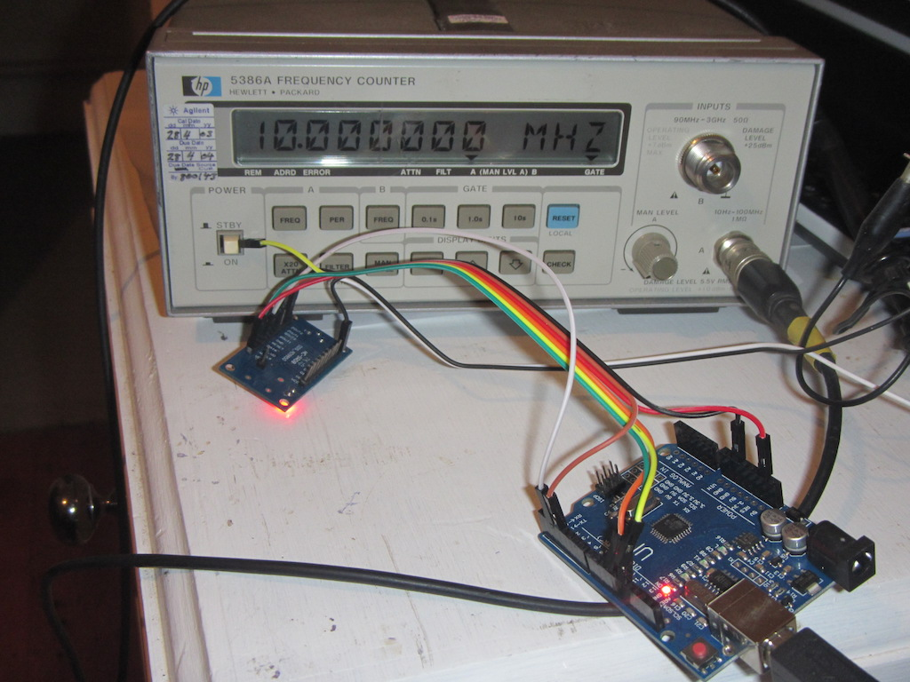

# AD9851 Direct Digital Synthesis Arduino Library

AD9851 is a chip from Analog Devices for direct digital sythesis of radio frequency signals.
This is a template class for controlling the AD9851.

## Setup Functions

Instantiate the AD9851 template with the appropriate parameters.
You must provide a Reset pin and a digital pin number to be used for chip select (FQ/UD):
The SPI SCK and MOSI pins will be used automatically.

    #define AD9851_RESET_PIN      3
    #define AD9851_FQ_UD_PIN      2

    class MyAD9851 : public AD9851<AD9851_RESET_PIN, AD9851_FQ_UD_PIN> {};
    MyAD9851 dds;

The third template parameter is the core clock frequency, including
the PLL multiplier. The AD9851 can use up to a 180MHz core clock.

The fourth template parameter is the SPI data rate, default 2Mb/s.
You should not try to alter the fifth and sixth parameters, as these
are set by the SPI driver.

The AD9851 reset will be applied at the time the constructor is run.
Alternatively, you can reset the chip at any time later:

    dds.reset();

If you have a good frequency counter, you can calibrate your AD9851.
To calibrate, use a zero calibration value, set some frequency and
measure it as accurately as you can with a frequency counter.
Convert that value to parts-per-billion error (positive if the
frequency is high, negative if low) and provide that integer to
setClock() as the calibration value instead. For example if you
program 10MHz, but measure 1000043.2Hz, your calibration factor
should be 4320.

You must setFrequency() after calling setClock with a new calibration,
and recalculate any stored frequency deltas.

    setClock(uint32_t calibration = 0);

## Setting the frequency

The setFrequency() function tells the module what frequency to generate.

    dds.setFrequency(7140000UL);

If you have to change frequency often, use frequencyDelta() to compute
a delta value, and apply that with setDelta():

    uint32_t div = dds.frequencyDelta(7140000UL);
    dds.setDelta(div);
